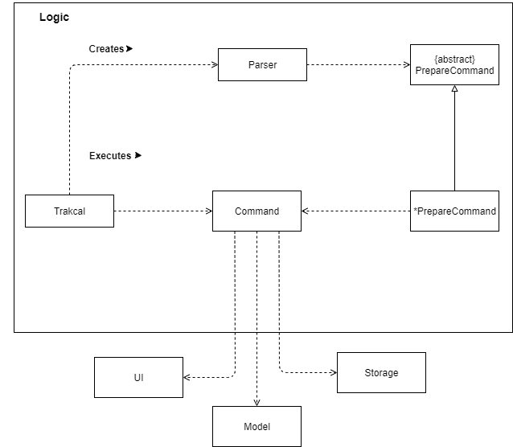

# Developer Guide
 

* Table of Contents
{:toc}

## Setting up

<br/>

### Prerequisites
 * Java 11 (can be download from here)
 * Intellij IDE
    
### Setting up:    
* Download the latest tracKCAL jar file (here)
* Copy jar file into an empty folder in a convenient location (eg. Desktop)
* Open terminal and navigate directory to the folder containing jar file 
* Enter the following command line to run program: ```java -jar tracKCAL.jar```   
* Look through the user guide for a full detailed explanation on the functionality of tracKCAL
    
## Design 

### Architecture

`spaceholder: i obly draw on paper for now`

The Architecture Diagram shown above explains the high-level design of tracKCAL. 

TracKCAL is made up of mainly 6 components.

`traKCAL`: 
`Ui`: displays any message that the user can see and interact with
`Logic`: Interprets what the user inputs
`Command`: Executes specific command according to interpretation by `Logic`
`Storage`: Saves required data into the hard disk or retrieves data 
`Model`: Visualize data into a graph

### Logic component



In the logic component, 

* Trakcal uses the parser class to filter based on command words by user.
* Description that comes after is further parsed down by the Parser.
* Respective Command object is created and is executed by Trackcal.
* Respective execution methods can be further associated with `UI`, `Storage` and `Model` components.

### Storage component

### Model component

## Implementation

### Add feature

### Advance List feature

### Edit feature

### Chaining feature

### Find feature

### Graph feature


## Appendix: Requirements

### Product scope

#### Target user profile

{Describe the target user profile}
>Tech savvy university students that have knowledge on the exercise and calories or know where to get the information before inputting it in the application.

#### Value proposition

{Describe the value proposition: what problem does it solve?}
* Functionality
    - Provides greater flexibility of use.
    - Can be used to do things that are difficult or impossible to do with a GUI.
* Speed
    - GUI required additional system resource to load the graphical part, thus slower than CLI
    - Less memory usage
* Scripting & automation
    - Have greater control over system functions
    - Commands can be given via a line command and then code does the work whereas in GUI, more than one action have to be repeated to perform a command


### User Stories

|Version| As a ... | I want to ... | So that I can ...|
|--------|----------|---------------|------------------|
|v1.0|new user|see usage instructions|refer to them when I forget how to use the application|
|v1.0|user|add food consumed/exercise done|keep track of my daily activities|
|v1.0|user|list out the activities done for the day|track it and amend it if any errors occur|
|v1.0|user|delete entries entered|remove erroneous entries|
|v1.0|forgetful user|find activities via keyword|pull out the entries that I want|
|v1.0|beginner in working out|track the calories intake|feel assured that my workout is on the right track|
|v1.0|student who is a health enthusiast|keep track of my daily intake of calories|better manage my health|
|v2.0|gym user|upload the amount of calories consumed or lost|track the surplus or deficit of calories|
|v2.0|overweight student|calculate the estimated amount of calories lost|facilitate my weight loss regime|
|v2.0|underweight student|calculate the estimated amount of calories gained|facilitate my weight gain regime|
|v2.0|weight conscious person|track the amount of calories gained or lost|maintain my weight|
|v2.0|careless student|go back and edit entries entered earlier|correct the errors I have made|
|v2.0|frequent user|have pre-set repetitive actions entered by me|save time when inputting data|

### Use Cases

### Non-Functional Requirements

{Give non-functional requirements}

### Glossary

* *glossary item* - Definition
* *GUI* - Graphics User Interface

### Instructions for manual testing

{Give instructions on how to do a manual product testing e.g., how to load sample data to be used for testing}
