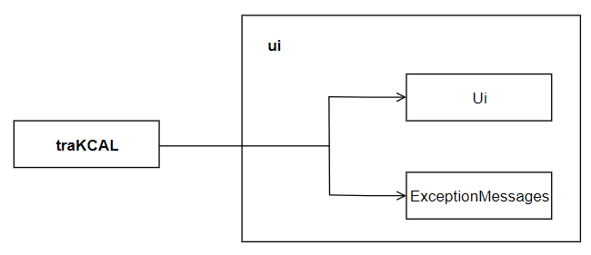
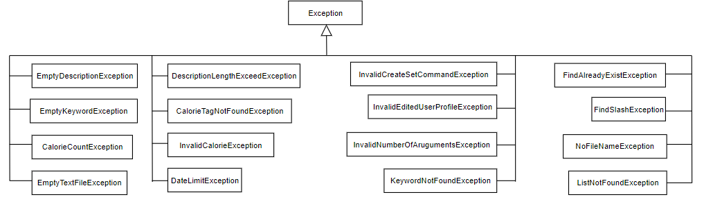
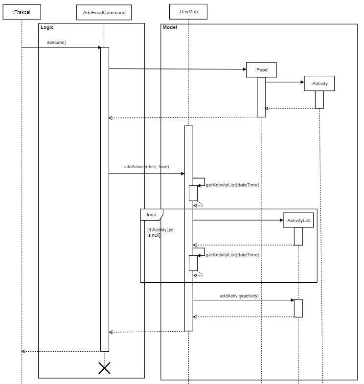
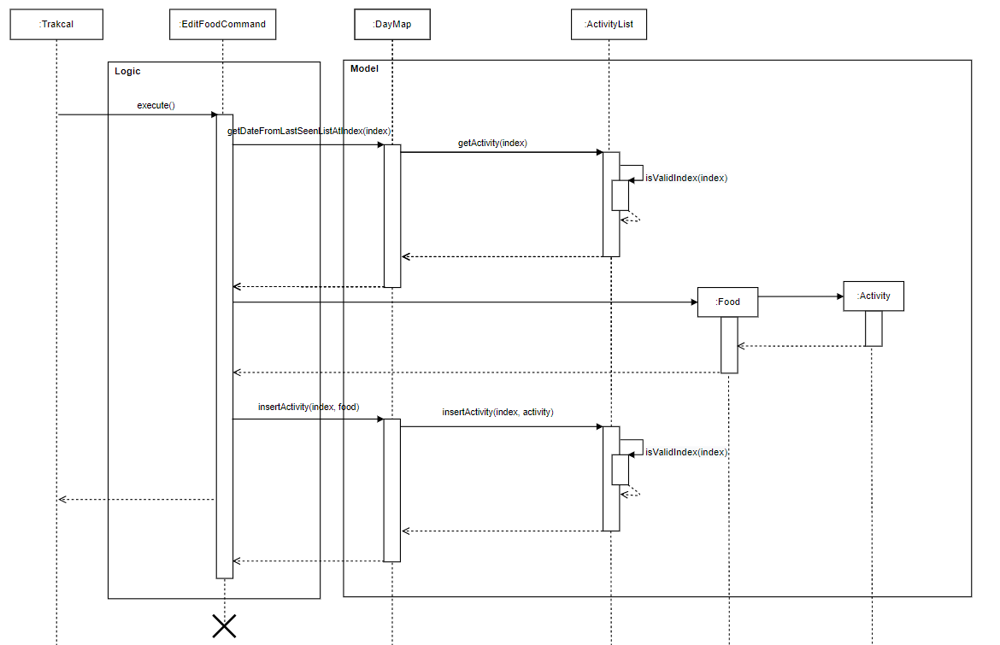

# Developer Guide for traKCAL

The purpose of this developer guide is as reference for future collaborators of **trakCAL**.

By: CS2113-T09-4 <br>   Since: October 2020  <br> Licence: MIT

<br>

## 1.0 Introduction

**Welcome to traKCAL!**

**traKCAL** is a desktop application for managing and visualizing your calorie intake, optimized for use via Command Line Interface (CLI) whilst retaining the benefits of a Graphical User Interface (GUI). 

This guide will provide information on the design and implementation of **traKCAL** to help you get started on your journey of becoming a contributor to **traKCAL**. This guide will also explain the various features available in **traKCAL**, to provide you with a better understanding of the current version of **traKCAL**

<br>

### 1.1 Table of Contents

* Table of Contents
{:toc}

<br>

### 2.0 Prerequisites
 * Java 11 (can be download from [here](https://docs.aws.amazon.com/corretto/latest/corretto-11-ug/downloads-list.html))
 * Intellij IDE

<br>
<br>

## 2.1 Setting up
1. Fork the traKCAL repository [here]() and git clone it to a convenient location on your desktop eg. Desktop.
2. Open any IDE (Intellij preferred) and click `Configure` -> `Project Defaults` -> `Project Structure` -> `New` and ensure that a valid Java 11 SDK is selected.
3. Next, go to `Import Project` and select the *build.gradle* file. 
4. Click `Open as Project` and accept all default settings. 
5. After opening the project, go to `src` -> `main` -> `java` -> `seedu.duke` -> `Trakcal` and right click on the Trakcal class. Select the `Run 'Trakcal.main()'` option.
6. Upon successful run, the following opening message will be shown: 

    ```
    ====================================================================================
    | Hello from                                                                       |
    |  _                  _  __   ___     _     _                                      |
    | | |_   _ _   __ _  | |/ /  / __|   /_\   | |                                     |
    | |  _| | '_| / _` | | ' <  | (__   / _ \  | |__                                   |
    |  \__| |_|   \__,_| |_|\_\  \___| /_/ \_\ |____|                                  |
    |                                                                                  |
    | Hello! I'm traKCAL.                                                              |
    | Please do input 'help' for the commands and their respective input format.       |
    ====================================================================================
    ```

7. You will then be prompted to create a new user profile.  


<br>
<br>    
    
## 3.0 Design 

### 3.1 Architecture


*Figure 1. Architecture diagram of traKCAL*

The Architecture Diagram shown above explains the high-level design of **traKCAL**. There are 8 components in traKCAL, and their functionalities will be discussed below:

<br>

### 3.2 Ui component



*Figure 2. Diagram for UI component*

The UI component deals with interactions with the user by displaying appropriate messages to the user, including the welcome message and appropriate error messages whenever an error has been detected. 


<br>

### 3.3 Logic component


*Figure 2. Diagram for logic component*


 \* This means that there are multiple PrepareCommand children classes inherited by the PrepareCommand class.

The main bulk of data processing takes place in the logic component. In this component, 
the data from the user input is checked for its validity and parsed down further to the PrepareCommand class to its respective command classes.
These command classes are derived from the Command class. Each different command block deals with the 
proposed functionality which can be associated with `Ui`,`storage` or `model` components. 

* **traKCAL** uses the parser class to filter based on command words by user.
* Description that comes after is further parsed down by the PrepareCommand class 
and validity of those description are checked..
* Respective Command object is created and is executed by **traKCAL**.
* Respective execution methods can be further associated with `UI`, `Storage` and `Model` components.

<br>

### 3.4 Model component


*Figure 3. Diagram for Model component*


In the Model component, 

* Contains a hashmap, dayMap, where the key is the date and the value is the list of activities for the respective day.
* Contains a list of activities, lastSeenList where this list would contain the activities 
* Does not depend on any of the other components.

<br>

### 3.5 Command component

Before executing the command, user input has to be prepared first to ensure that all the parameters are correctly in place. 
This is done by the PrepareCommand class.


*Figure 4. Diagram for PrepareCommand*

After preparing the user input and ensuring that all necessary parameters are in place, the respective prepareCommand classes will return a 
command which will be executed by traKCAL. Below shows all the different Command classes inherited.


*Figure 4. Diagram for Command component*

<br>

### 3.6 Storage component

**traKCAL** saves both user profile data and activity entries in a text file and csv (comma separated values) file respectively. <br>
It also handles the logging file that records down the different types operations or errors that was performed during the program.


*Figure 5. Diagram for Storage component*

<br>

On program launch:

1. `Storage` is initialised and checks for existing saved data.
2. If saved data exists, `Storage` will read the saved data and parses them into model objects such as activity lists for the activity data.
3. Else, if saved data does not exist, `Storage` will create an empty save file in the tpData directory.
4. New users will be prompted to create their profile by inputting their details and saved through `UserInfoStorage`.

On Command execution:

* Whenever the user changes the list by performing an operation such as *add* or *delete* entry, `Storage` parses the model objects and writes into the csv file.
* The respective logs will also be updated according to the given commands through `Logging`.
* `UserSetStorage` will store the relevant shortcuts created by the using *createSet* command is called.

<br>

### 3.7 Exception component

This component contains all the exception classes used in traKCAL.



*Figure 6. Diagram for Exception component*

<br>

### 3.8 UserProfile component

This component contains the information such as the user's name, gender, height, weight, active level and the weight goal. 


*Figure 4. Diagram for UserProfile component*

<br>
<br>

## 4.0 Implementation

## 4.1 Create User Profile feature

#### Current Implementation

The sequence diagram below shows how the components will react to a new user or for a returning user. 


*Figure 7. Components interactions for **traKCAL** create user profile feature*

The following has been omitted from the diagram to increase readability: 
* Exception handling 
* External text file creation block

<br>

#### Design Considerations

* New users are required to create a new user profile before being able to use other features like `graph` to avoid unnecessarily being thrown exceptions.
* Genders were limited to female and male instead of other genders like binary as our recommended calories equation only took into account female and male as genders.
* Similarly, weight goals were limited to lose, maintain or gain as opposed to other forms of weight goal like cut as our current equations were only able to accomodate lose, maintain or gain.

<br>
<br>

## 4.2 Shortcut feature

### 4.2.1 Creating a shortcut

#### Current Implementation

The sequence diagram below shows how the components in **traKCAL** work together to create a new shortcut. 

Users can create a shortcut with unlimited number of entries in this format: `createSet **SHORTCUT_NAME** ...`

Some examples include:
>`createSet **SHORTCUT_NAME** f/ **FOOD_DESCRIPTION** c/ **CALORIE_COUNT** + f/ **FOOD_DESCRIPTION** c/ **CALORIE_COUNT**`

>`createSet **SHORTCUT_NAME** e/ **EXERCISE_DESCRIPTION** c/ **CALORIE_COUNT**`

>`createSet **SHORTCUT_NAME** e/ **EXERCISE_DESCRIPTION** c/ **CALORIE_COUNT** + e/ **EXERCISE_DESCRIPTION** c/ **CALORIE_COUNT** + f/ **FOOD_DESCRIPTION** c/ **CALORIE_COUNT**`


*Figure 8. Components interaction for **traKCAL** create set feature*

<br>

#### Design Considerations

* At least one activity tag (`e/` or `f/`) and calorie tag (`c/`) must be specified by user for a shortcut to be created.
* The order of the entry must be activity tag first before calorie tag. Calorie tag followed by activity tag is not allowed. This is to facilitate the adding of each entry in the shortcut, as seen in [section 4.3](#43-add-activity-feature).
* Multiple entries in shortcut should be separated by a `+`. 

<br>
<br>

### 4.2.2 Using a shortcut to add to a activity list

#### Current Implementation

The sequence diagram below shows how the components in **traKCAL** work together to add entries in a shortcut to the activity list. 

Users can call any existing shortcut in this format: `addSet **SHORTCUT_NAME**`


*Figure 9. Components interaction for **traKCAL** add set feature*


<br>

#### Design Considerations

* Activities added using shortcuts are only added to the activity list for the current date.

<br>
<br>


## 4.3 Add activity feature

#### Current Implementation

The adding mechanism is used by `AddFoodCommand` and `AddExerciseCommand` to add to the list of date stated in user input. If date is not stated, then it will be added to today's list.

The following sequence diagram shows how `AddFoodCommand` is carried out when the user issues add command, in this case, `add f/ food c/ 170 d/ 2020-10-22`:



*Figure 10. Component interactions for add food command*

> `AddExerciseCommand` diagram has a similar logic.


<br>

#### Design Considerations

Aspect: How to add food/exercise

>Current choice: Using single letter words as tags for input commands. (e.g. add f/ jelly c/ 100 d/ 2020-11-09)
>* Pros: Faster and shorter input keys for user.
>* Cons: Have to ensure that user is clear on what tags to input.

>Alternative: Using full words as tags for input commands. (e.g. add food/ chicken chop calorie/ 70 date/ 2020-11-08)
>* Pros: Tags are obvious in what input is expected.
>* Cons: More wordy input needed from user.


Aspect: Input parameters for add food/exercise

>Current choice: Input format for adding: `add f/ FOOD_DESCRIPTION c/ CALORIE_COUNT <d/ DATE>` OR `add f/ EXERCISE_DESCRIPTION c/ CALORIE_COUNT <d/ DATE>`
>Where words in CAPS are parameters to be filled by the user and word in <this> are optional. Not including the <date> parameter would add to today's list.
>* Pros: Faster and shorter input time for user.
>* Cons: Have to ensure that user entry would be added to the correct date.

>Alternative: Input format for adding: `add f/ FOOD_DESCRIPTION c/ CALORIE_COUNT d/ DATE` OR `add f/ EXERCISE_DESCRIPTION c/ CALORIE_COUNT d/ DATE`
>Where words in CAPS are parameters to be filled by the user. 
>* Pros: List where food/exercise entry to be added to is clear.
>* Cons: Longer input time for user.

<br>
<br>

### 4.4 Listing feature for find and list commands

The listing mechanism used by `ListCommand` and `FindCommand` to display the required list of activities is facilitated by the lastSeenList of class `ActivityList`. 
The lastSeenList is the list that the user would see after a `list` or `find` command. <br>
The following operations could be applied to the lastSeenList which would change the actual data in the database:

- delete
- move
- edit

The details of those operations can be found further down.

<br>

#### 4.4.1 List

The `list` command displays the list of entries for the current date while the `list <DATE>` command displays the list of entries for the date as specified by the <DATE> parameter.

For example, 
* A `list 2020-11-11` command would use the activityList for 2020-11-11 as the lastSeenList.<br>


Given below is an example usage scenario and how the lastSeenList behaves for different `list` commands.

<br>

Step 1. The user launches the application for the first time. The lastSeenList will be pointed to the ActivityList for today's date.
This means that any `edit`, `delete` or `move` commands will be performed on the ActivityList for today's date in this case, the date would be 2020-11-12.

*Figure 12. First state of lastSeenList*

<br>

Step 2. The user executes a `list 2020-11-10`. This `list 2020-11-10` command causes the lastSeenList to be pointed to the actvityList for 2020-11-10.
This This means that any `edit`, `delete` or `move` commands will be performed on the activityList for 2020-11-10.

*Figure 13. Second state of lastSeenList*

<br>


The following sequence diagram shows how the lastSeenList is set after a “list date" command where date is of YYYY-MM-DD or after a “list” command where the date is the current date.


*Figure 14. Sequence diagram of setting the lastSeenList after a `list` command*

#### Design considerations

* Allowing the user to view the list of activities for the current date by not including the `<DATE>` parameter would make it easier for the user.

<br>
<br>

#### 4.4.2 Find

This listing feature for the `find` command also uses the lastSeenList which is of ActivityList class.  <br>
The lastSeenList is the list that the user would see after a `list` command. <br>
Using the lastSeenList allows users to make changes e.g `delete` command using the numbered index of a single `find` command.

For example, 
* A `find e/ food` command would loop through the dayMap and add activities containing the keyword/s into the lastSeenList.

The editing mechanism is used by the basic find features: `FindDescriptionCommand`, `FindCalorieCommand`, 
as well as the advanced find features: `FindAllCommand` and `FindEitherCommand` to look for keywords in the list.

Given below is an example usage scenario and how the lastSeenList for a `find` command.

Step 1. The user executes a `find e/ running` This `find e/ running` command will intialize the lastSeenList to a new ActivityList and is made up of Activities that contains the `running` keyword as per the command.
This lastSeenList will not point to any other activityList in the dayMap hashmap.

*Figure 12. Third state of lastSeenList*

<br>

The following sequence diagram shows how the lastSeenList is set after a find command.


*Figure 13. Sequence diagram of setting the lastSeenList after a find command*

<br>
<br>

### 4.5 Displaying the list after `find` or `list` commands

#### 4.5.1 Current implementation
The mechanism used to display the lastSeenList invoked by the list or find commands is facilitated by the listDrawer and findDrawer class respectively. 
They both work in a similar manner but the list produced by findDrawer has an extra column which contains the dates of the respective entries.

The following sequence diagram shows how the listDrawer class is used to display the lastSeenList.


*Figure 14. Sequence diagram of the usage of listDrawer to display the list*

#### Design considerations
* The list displayed to the user after both `find` and `list` commands has enough whitespace between the columns and rows to make it easier for the user to view the entries.
* The list displayed to the user after a `find` command has the date attribute at the left hand side of the list so as to make it easier for the user to connect the entries found to the respective date, making it easier for the user to make changes accurately

<br>
<br>

### 4.6 Edit activity in list feature

#### 4.6.1 Current Implementation

The editing mechanism is used by `EditFoodCommand` and `EditExerciseCommand` to amend the current list of activities.

The following Sequence Diagram shows how `EditFoodCommand` is carried out when the user issues edit command, in this case, `edit 1 f/ egg c/ 10`:



*Figure 15. Sequence diagram of edit food feature*

> `EditExerciseCommand` diagram has a similar logic.

<br>

#### 4.6.2 Design considerations

Aspect: How editing is carried out

>Current choice: User MUST pull out the list they want to edit to before calling the edit function. `list` then `edit f/ FOOD_DESCRIPTION c/ CALORIE_COUNT` OR `edit e/ EXERCISE_DESCRIPTION c/ CALORIE_COUNT`
>* Pros: The entry that is being edit is clear to the user.
>* Cons: More steps requried to edit an entry.

>Alternative: Adding a date tag in edit: `edit f/ FOOD_DESCRIPTION c/ CALORIE_COUNT d/ DATE` OR `edit e/ EXERCISE_DESCRIPTION c/ CALORIE_COUNT d/ DATE`
>* Pros: Faster and shorter time to edit an entry.
>* Cons: If list of the date is not pulled out and edit carried out immediately, high chance of the wrong entry being edited as there might be recent changes to the list.

<br>
<br>

### 4.7 Chaining feature

#### 4.7.1 Current Implementation

The chaining mechanism can be used by the various commands available The following are the types of command that can be chained:
- list
- add
- edit
- graph

The following sequence diagram shows how the chaining works after command is entered:


*Figure 17. Sequence diagram of chaining feature*


*Figure 18. Object diagram of allowed PrepareCommand subclass*


*Figure 19. Object diagram of allowed Command subclass*

<br>

#### 4.7.2 Design considerations

Aspect: Which features to chain

>Alternative 1 (current choice): Allow only certain features to be chained.
>* Pros: Able to better track input of users.
>* Cons: User must know which commands can be chained.

>Alternative 2: Allow all features to be chained.
>* Pros: Easy to implement. Attribute canBeChained marked as true for all features.
>* Cons: May give abnormal behaviour. As some features have dependencies on other features.

<br>
<br>

### 4.8 Move feature
This feature allows the user to manually move an activity from one position to another.

The following sequence diagram shows how the `move` command is executed, where index1 is the position to be moved from and index 2 is the position to be moved below. 


*Figure 20. Sequence diagram of move feature*

<br>
#### Design Considerations

* Pros: The tags `from/` and `below` was used to make this command more intuitive for the user.
* Cons: For the user to move an activity from a position to the 1st position, the index tied to the `below/` tag would have to be 0 which may not be as clear to the user. 
        For example, `move from/ 2 below/ 0`


<br>

### 4.9 Graph feature

The graph implementation shows the progress of the daily net 
calories over the period of 7 days. The GraphProperty class extracts the available days from the 
stored data in the application.

The days are sorted accordingly and the latest 7 days are chosen from the sorted list. 
The GraphProperty class extracts these data and calculates the attributes needed to build the graph. The GraphDrawing class makes use of these properties
to draw the graph.

> Examples of graph properties include:
> 1. Maximum/minimum calories
> 1. Calorie interval
> 1. 2-Dimensional array representation of the graph


*Figure 21. Sequence diagram of move feature*

As shown above, when the execute command of GraphCommand is called, the GraphProperty object 
is created, the properties of the graph are then stored and calculated in setProperty function.

Next, the graphDrawing object is created and uses the properties calculated earlier to print out the graph.
> In the case where there are less than 7  days stored, all the days will be displayed.

<br>
<br>

#4.10 Delete feature


* Figure 13. Sequence diagram of delete by index feature

## 5.0 Appendix: Requirements

### 5.1 Product scope

#### 5.1.1 Target user profile

{Describe the target user profile}
* Tech savvy university students that have knowledge on the exercise and calories or know where to get the information before inputting it in the application.
    - Fast typist
    - Prefers desktop applications
    - Prefers typing to mouse interactions
    - Conscious about daily calorie intake
    - Conscious about weight
    - Is reasonably comfortable using CLI applications

<br>

#### 5.1.2 Value proposition

{Describe the value proposition: what problem does it solve?}
* Functionality
    - Provides greater flexibility of use.
    - Can be used to do things that are difficult or impossible to do with a GUI.
* Speed
    - GUI required additional system resource to load the graphical part, thus slower than CLI
    - Less memory usage
* Scripting & automation
    - Have greater control over system functions
    - Commands can be given via a line command and then code does the work whereas in GUI, more than one action have to be repeated to perform a command

<br>

### 5.2 User Stories

|Version| As a ... | I want to ... | So that I can ...|
|--------|----------|---------------|------------------|
|v1.0|new user|see usage instructions|refer to them when I forget how to use the application|
|v1.0|user|add food consumed/exercise done|keep track of my daily activities|
|v1.0|user|list out the activities done for the day|track it and amend it if any errors occur|
|v1.0|user|delete entries entered|remove erroneous entries|
|v1.0|forgetful user|find activities via keyword|pull out the entries that I want|
|v1.0|beginner in working out|track the calories intake|feel assured that my workout is on the right track|
|v1.0|student who is a health enthusiast|keep track of my daily intake of calories|better manage my health|
|v2.0|gym user|upload the amount of calories consumed or lost|track the surplus or deficit of calories|
|v2.0|overweight student|calculate the estimated amount of calories lost|facilitate my weight loss regime|
|v2.0|underweight student|calculate the estimated amount of calories gained|facilitate my weight gain regime|
|v2.0|weight conscious person|track the amount of calories gained or lost|maintain my weight|
|v2.0|careless student|go back and edit entries entered earlier|correct the errors I have made|
|v2.0|frequent user|have pre-set repetitive actions entered by me|save time when inputting data|

<br>

### 5.3 Non-Functional Requirements

{Give non-functional requirements}

1. Should work on any mainstream OS as long as it has Java 11 or above installed.
2. A user with above average typing speed for regular English text (i.e. not code, not system admin commands) should be able to accomplish most of the tasks faster using commands than using the mouse.

<br>

### 5.4 Glossary

* *GUI* - Graphics User Interface
* *CLI* - Command Line Interface
* *OS* - Operating System
* *mainstream OS* - Windows, Linus, MacOS, OS-X, Unix
* *API* - Application Programming Interface
* *MSS* - Main Success Scenario

<br>

### 5.5 Instructions for manual testing

{Give instructions on how to do a manual product testing e.g., how to load sample data to be used for testing}

Starting up application
1. Ensure that you have Java 11 or above installed, if not, it can be found [here](https://docs.aws.amazon.com/corretto/latest/corretto-11-ug/downloads-list.html)
2. Down the latest version of `trakCAL` from [here](https://github.com/AY2021S1-CS2113T-T09-4/tp/releases)
3. Create an empty folder in a convenient location eg. Desktop and copy jar file over to it.
4. Open command window/terminal in that window and navigate into the file directory,
5. Run the command `java -jar {filename}.jar` e.g., `java -jar traKCAL.jar`.
6. Upon successful run, you will get the following greeting message.

```
====================================================================================
| Hello from                                                                       |
|  _                  _  __   ___     _     _                                      |
| | |_   _ _   __ _  | |/ /  / __|   /_\   | |                                     |
| |  _| | '_| / _` | | ' <  | (__   / _ \  | |__                                   |
|  \__| |_|   \__,_| |_|\_\  \___| /_/ \_\ |____|                                  |
|                                                                                  |
| Hello! I'm traKCAL.                                                              |
| Please do input 'help' for the commands and their respective input format.       |
====================================================================================
```

7. Enter `help` to view help list containing the features, and their respective input format.
8. For a detailed list on the available features, please refer to [user guide](UserGuide.md)

Exiting the application
1. To terminate **traKCAL**, enter `bye`. A successful terminating of application would look like this:

```
=====================================================================================================
| Thank you for using traKCAL. See you again!                                                       |
=====================================================================================================
```

#### Editing user profile

>Editing user name and gender
>* Test case: `user e/ n/ Sam , g/ female`
>* Expected: User name will be changed to `Sam` and user gender will be changed to `female`.
 
>Editing user activity level
>* Test case: `user e/ al/ 3`
>* Expected: User activity level will be changed to `3`.
 
>Incorrect inputs to try:
>* `user e/ n/        `: empty description for name
>* `user e/ g/ meIsMale`: invalid gender type
>* `user e/ g/ gender + n/ tom`: wrong separator used. gender will be read as `gender + n/ tom` instead. `+` should be changed to `.`
>* `user e/ g/ female , w/ 1000000`: weight is not within 30 to 650 kg range
>* `user e/ g/ female , w/ test`: weight is not of valid type to parse to an integer
>* `user e/ g/ male , h/ -10`: height is not within 90 to 300 cm range
>* `user e/ g/ female , h/ one hundred`: height is not of valid type to parse to an integer
>* `user e/ g/ female , age/ 200`: age is not within 10 to 120 years old range
>* `user e/ g/ male , age/ twenty`: age is not of valid type to parse to an integer
>* `user e/ g/ female , al/ 8`: age is not within 1 to 5
>* `user e/ g/ male , age/ twenty`: activity level is not of valid type to parse to an integer
>* Editing the user profile text file `tp.txt` will corrupt the next run and user will be directed to create a new user profile
>* `user e/ goal/ meWantLoseWeight`: invalid goal type
>* `user e/ jkdsfhdskjfhdksfkjsdf/ karen`: invalid tag
>* Expected: Message with error will be shown.

<br>

#### Creating a shortcut

>Creating a shortcut with 2 food entries
>* Test case: `createSet dinner f/ chicken c/ 100 + f/ beef c/ 100`
>* Expected: A text file named `dinner.txt` will be created in ... with first line as `f/ chicken c/ 100` and second line as `f/ beef c/ 100`.

>Creating a shortcut with 1 exercise entry
>* Test case: `createSet morning exercise e/ run c/ 100`
>* Expected: A text file named `morning exercise.txt` will be created in ... with first line as `e/ run c/ 100`.

>Creating a shortcut with 1 food entry and 1 exercise entry
>* Test case: `createSet morning routine f/ oatmeal c/ 300 + e/ jumping jacks c/ 50`
>* Expected: A text file named `morning routine.txt` will be created in ... with first line as `f/ oatmeal c/ 300` and second line as `e/ jumping jacks c/ 50`.
 
>Incorrect inputs to try:
>* `createSet f/ chicken c/ 100 + f/ beef c/ 100`: missing shortcut name
>* `createSet meat f/ chicken f/ fish`: each `f/` or `e/` must be followed be a `c/`
>* `createSet fishy lunch f/ fish c/      `: empty description for calories
>* `createSet fishy lunch f/        c/ 100`: empty description for food
>* `createSet healthy lunch`: missing activity and calorie tag
>* `createSet dinner f/ beans c/ 100000`: invalid calorie range, only 0 to 3000 kcal accepted
>* `createSet dinner f/ beans c/ test`: calorie not of valid type to parse to an integer
>* `createSet dinner f/ beans c/ 1000000000000000`: calorie too large to be an integer
>* Expected: Message with error will be shown.
 
<br>


#### Adding a shortcut into list

>Adding a shortcut
>* Test case: `addSet dinner`
>* Expected: Contents within `dinner.txt` will be added into today's list.

>Incorrect inputs to try:
>* `addSet test1`: if test1 is not yet created as shortcut
>* `addSet `: a shortcut name not specified
>* `addSet test2`: if test2 has been edited to the wrong format by user
>* Expected: Message with error will be shown.
 
<br>
 
#### Adding an entry into list

>Adding a food entry with date
>* Test case: `add f/ cheesy chicken c/ 180 d/ 2020-11-09`
>* Expected: An entry with food description `cheesy chicken` and calories of `100` would be added into 2020-11-09's list.

>Adding a food entry without date
>* Test case: `add f/ milk tea with pearls c/ 125`
>* Expected: An entry with food description `milk tea with pearls` and calories of `150` would be added into today's list.

>Adding an exercise entry with date
>* Test case: `add e/ walking c/ 10 d/ 2020-11-05`
>* Expected: An entry with exercise description `walking` and calories of `10` would be added into 2020-11-05's list.

>Adding an exercise entry without date
>* Test case: `add e/ 50 sit-ups c/ 75`
>* Expected: An entry with food description `50 sit-ups` and calories of `75` would be added into today's list.

>Incorrect inputs to try:
>* `add f/ jelly 90 `: has missing calorie tag
>* `add f/ jelly c/ 90 d/ 2020-10-13`: date is before application launch date, 2020-10-14 or after today's date
>* `add f/ jelly c/ -30`: calories is less than or equals to 0 or more than 3000
>* `add e/ jumping up and down in a merry round in Singapore c/ 80`: description is longer than 40 characters
>* `add e/ c/ `: empty input parameters
>* Expected: Message with error will be shown.

<br>

#### Editing an entry in list

This feature allows editing of list entry from:
1. food to food
2. food to exercise
3. exercise to food
4. exercise to exercise

Prerequisite: The index that the user want to edit on has to exist in the list.

>Editing an entry in today's list from food to food
>* Test case: `edit 1 f/ ice kacang c/ 90`
>* Expected: Entry at index `1` of today's list(which is a food entry) would be edited to food description of `ice kacang` and calories of `90`.

>Editing an entry in today's list from food to exercise
>* Test case: `edit 2 e/ running c/ 50`
>* Expected: Entry at index `2` of today's list(which is a food entry) would be edited to exercise description of `running` and calories of `50`.
       
>Editing an entry in another day's list from exercise to exercise
>* Test case: `list 2020-11-07` then `edit 3 e/ 50 jumping jacks c/ 25`
>* Expected: Entry at index `3` of 2020-11-07's list(which is an exercise entry) would be edited to exercise description of `50 jumping jacks` and calories of `25`.

>Editing an entry in another day's list from exercise to food
>* Test case: `list 2020-11-01` then `edit 2 f/ corn chips c/ 75`
>* Expected: Entry at index `3` of 2020-11-01's list(which is an exercise entry) would be edited to food description of `corn chips` and calories of `75`.

>Incorrect inputs to try:
>* `edit 1 f/ jelly c/ -30`: calories is less than or equals to 0 or more than 3000
>* `edit 2 e/ jumping up and down in a merry round in Singapore c/ 80`: description is longer than 40 characters
>* `edit 3 e/ c/ `: empty input parameters
>* Expected: Message with error will be shown.

<br>

#### Chaining of features

This feature allows only 4 features to be chained, add, list, edit and graph.
*There is no fixed format as there are many combinations available!*
*Input commands MUST be separated by `&&`*

>Example 1
>* Test case: `add f/ ice cream c/ 90 && add e/ running c/ 50 && list`
>* Expected: An entry with food description `ice cream` and calories of `90` would be added into today's list, an entry with exercise description `running` and calories of `50` would be added into today's list and today's list would be printed out.

>Example 2
>* Test case: `list && graph`
>* Expected: Prints today's `list` and `graph`

>Example 3
>* Test case: `list && list 2020-11-06 && list 2020-11-08`
>* Expected: Prints today's list, prints 2020-11-06's list and prints 2020-11-08's list

>Example 4
>* Test case: `add f/ ice cream c/ 90 d/ 2020-11-07 && list && edit 7 e/ walking c/ 15`
>* Expected: An entry with food description `ice cream` and calories of `90` would be added into today's list, prints today's list and entry at index `7` of today's list would be edited to exercise description of `walking` and calories of `15`.

>Incorrect inputs to try:
>* Test case: The incorrect input from [add](#adding-an-entry-into-list), list, [edit](#editing-an-entry-in-list), graph
>* Expected: Message with error will be shown.


#### Find feature
>Finding an entry using find d/
>* Test case: `find d/ apple`
>* Expected: All entries with food description `apple` would be displayed.

>Finding an entry using find c/
>* Test case: `find c/ 500`
>* Expected: All entries with calories count `100` would be displayed.

>Finding an entry using find a/
>* Test case: `find a/ run / garden / evening`
>* Expected: All entries with descriptions containing `run`, `garden` **and** `evening` would be displayed.

>Finding an entry using find e/
>* Test case: `find e/ walk / jump / kick`
>* Expected: All entries with descriptions containing at least one of of the keyword "`walk`, `jump` **or** `kick`" would be displayed.

>Incorrect inputs to try:
>* Test case: Not specifying keywords to be searched for. Example: `find d/`
>* Expected: Message with error will be shown.
>
>* Test case: Consecutive slashes in input for `a/` or `e/`. Example:`find a// apple / pie`
>* Expected: Message with error will be shown.


#### List Feature
>Listing the activities for today
>* Test case: `list`
>* Expected: The list of activities for today would be displayed unless the list is empty.
 
>Listing the activities for a specific day
>* Test case: `list 2020-11-31`
>* Expected: The list of activities would be displayed unless the list is empty.

>Incorrect inputs to try:
>* Test case: `list 2020/11/31`
>* Expected: The list for 2020-11-31 will not be displayed and a error message will be shown.


#### Move feature
>Moving an activity from the 1st position to the 4th position
>* Test case: `move from/ 1 below/ 3`
>* Expected: The activity at position 1 will be move to position 4 in the list.

>Moving an activity from the 4th position to the 1st position
>* Test case: `move from/4 below/0`
>* Expected: The activity at position 4 will be moved to the 1st position in the list.

>Other incorrect commands to try
>* Test case: `move from/2 below/2`
>* Expected: There would be no change. An error message will be shown.
>
>* Test case: `move from/0 below/2`
>* Expected: 0 is a invalid index. An error message will be shown.
>
>* Test case: `move from/2 below/1`
>* Expected: There would be no change. An error message will be shown.