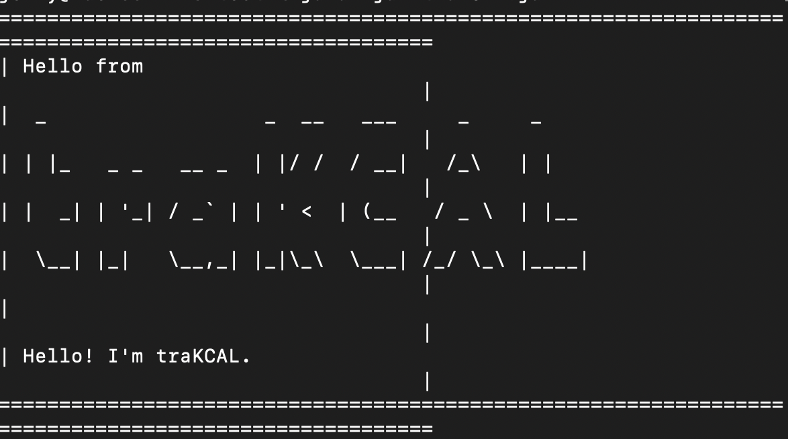

# User Guide for traKCAL

The purpose of this user guide is to guide the users on the commands available in this application, their respective uses and the expected inputs.

By: CS2113-T09-4     Since: October 2020    Licence: MIT

<br>

# Introduction

**Welcome to traKCAL**

**traKCAL** is a desktop application for managing and visualizing your calorie intake, optimized for use via Command Line Interface (CLI) whilst retaining the benefits of a Graphical User Interface (GUI). 

If you are a fast typer, **traKCAL** is perfect for you!

<br>

## Table of Contents

* Table of Contents
{:toc}

<br>

# Quick Start

This section gives the steps you need to get started quickly.

1. Ensure that you have Java 11 or above installed, if not, it can be found [here](https://docs.aws.amazon.com/corretto/latest/corretto-11-ug/downloads-list.html)
2. Down the latest version of `trakCAL` from [here](https://github.com/AY2021S1-CS2113T-T09-4/tp/releases)
3. Create an empty folder in a convenient location eg. Desktop and copy jar file over to it.
4. Open command window/terminal in that window and run the command `java -jar {filename}.jar` e.g., `java -jar traKCAL.jar`.
5. Upon successful run, you will get the following greeting message.

```
====================================================================================
| Hello from                                                                       |
|  _                  _  __   ___     _     _                                      |
| | |_   _ _   __ _  | |/ /  / __|   /_\   | |                                     |
| |  _| | '_| / _` | | ' <  | (__   / _ \  | |__                                   |
|  \__| |_|   \__,_| |_|\_\  \___| /_/ \_\ |____|                                  |
|                                                                                  |
| Hello! I'm traKCAL.                                                              |
| Please do input 'help' for the commands and their respective input format.       |
====================================================================================
```
   * Tip: 
     Increase your windows length if the greeting message appears congested like this:
     

6. Type a command in the command box and press Enter to execute it. e.g. typing `help` and pressing Enter will open the help window

   Some example commands you can try:
    * `list`: Lists all activities for today
    * `add f/ apple c/ 30`: Adds a food entry named `apple` and of calories `30` to today's list **trakCAL**.
    * `delete 3`: Deletes the 3rd contact shown in the current list.
    * `bye`: Exits the application.
    
7. Refer to the [Features](#features) below for details of each command

<br>

# Features 

This section gives you a detailed description of each feature available in **traKCAL**.

>Some things to take note of:
>* Inputs that look like `**THIS**` are compulsory parameters for you to fill in.
>* Inputs that look like `<THIS>` are optional parameters that you do not need to fill in to achieve the desired outcome.  
>* Input format should adhere to the one in the help list or in this user guide.
>* All features such as `add`, `edit`, `list`, etc. are not case-sensitive, but it is recommended for you to follow the format stated in help list or this user guide.

<br>
<br>

## 1.0 Viewing help - Puah Siew Wen

Do you need help? Do you need a reminder of what the features available, and their respective input format? Well this section solves it for you!

Format: `help`

Example of usage:
* `help`

```
====================================================================================================
This section displays the commands available and their respective input format.
> Words in CAPS are parameters to be filled in by you!
> Variables in <here> are optional!
Viewing help:
help                   - Prints out commands available and their input format

User Profiling
user l/                - Prints out current user profile
user c/                - Creates new user profile
user e/ <n/ NAME>, <g/ GENDER>, <w/ WEIGHT>, <h/ HEIGHT>, <age/ AGE>, <al/ ACTIVITY_FACTOR>,
                         <goal/ GOAL>
                       - Edits user profile to name, NAME, gender(male/female), GENDER,
                         height(in cm), HEIGHT, age, AGE, activity factor(1-5), ACTIVITY_FACTOR,
                         goal(lose/maintain/gain), GOAL

Creating shortcut:
*[This command is extensive, there are a lot of variations. The following is one such example]*
createSet SHORTCUT_NAME f/ FOOD_DESCRIPTION c/ CALORIE_COUNT +
e/ EXERCISE_DESCRIPTION c/ CALORIE_COUNT + f/ FOOD_DESCRIPTION c/ CALORIE_COUNT
*[Another possible example is:]*
createSet SHORTCUT_NAME f/ FOOD_DESCRIPTION c/ CALORIE_COUNT + f/ FOOD_DESCRIPTION c/ CALORIE_COUNT
                       - Creates shortcut, SHORTCUT_NAME for adding food(s) and/or exercise(s)
                         depending on the format entered
addSet SHORTCUT_NAME   - Adds SHORTCUT_NAME that was created in createSet into today's list

Adding:
add f/ FOOD_DESCRIPTION c/ CALORIE_COUNT
                       - Adds food consumed, FOOD_DESCRIPTION and calories gained, CALORIE_COUNT
                         to today's date
add f/ FOOD_DESCRIPTION c/ CALORIE_COUNT d/ DATE
                       - Adds food consumed, FOOD_DESCRIPTION, calories gained, CALORIE_COUNT
                         and date(YYYY-MM-DD), DATE
add e/ EXERCISE_DESCRIPTION c/ CALORIE_COUNT
                       - Adds exercise done, EXERCISE_DESCRIPTION and calories lost, CALORIE_COUNT
                         to today's date
add e/ EXERCISE_DESCRIPTION c/ CALORIE_COUNT d/ DATE
                       - Adds exercise done, EXERCISE_DESCRIPTION, calories lost, CALORIE_COUNT
                         and date(YYYY-MM-DD), DATE

Listing:
list                   - Prints out the list of entries.
list DATE              - Prints out the list of entries for the date(YYYY-MM-DD), DATE

Editing:
edita LIST_INDEX f/ FOOD_DESCRIPTION c/ CALORIE_COUNT
                       - Edits activity at index LIST_INDEX of latest list printed out
                         to food consumed, FOOD_DESCRIPTION, calories gained, CALORIE_COUNT
edita LIST_INDEX e/ EXERCISE_DESCRIPTION c/ CALORIE_COUNT
                       - Edits activity at index LIST_INDEX of latest list printed out
                         to exercise done, EXERCISE_DESCRIPTION, calories lost, CALORIE_COUNT

Finding:
find d/ DESCRIPTION    - Searches for all activities description with the DESCRIPTION keyword
find c/ CALORIE_COUNT  - Searches for all activities with calories of CALORIE_COUNT
find a/ DESCRIPTION1 / DESCRIPTION2 ... / DESCRIPTION
                        - Searches for all activities with ALL matching keywords from
                          DESCRIPTION1 to DESCRIPTION
find e/ DESCRIPTION1 / DESCRIPTION2 ... / DESCRIPTION
                        - Searches for all activities with AT LEAST one matching keyword from
                          DESCRIPTION1 to DESCRIPTION

Moving:
move from/ INDEX1 below/ INDEX2
                       - Moves the activity at index INDEX1 to the index below INDEX2

Deleting:
delete LIST_INDEX      - Deletes activity located at index LIST_INDEX of latest list printed out
delete all/            - Deletes all activities in current date list

Graphing:
graph                  - Generates a graph of target calorie and net calorie obtained up to
                         last 7 days

Chaining:
*[This command is extensive, there are a lot of variations,
                          but is only available to add, list and edita.]*
*[One possible example is:]*
add f/ FOOD_DESCRIPTION c/ CALORIE_COUNT d/ DATE && list && edita LIST_INDEX f/ FOOD_DESCRIPTION
                         c/ CALORIE_COUNT
*[Another possible example is:]*
add f/ FOOD_DESCRIPTION c/ CALORIE_COUNT d/ DATE && add e/ EXERCISE_DESCRIPTION c/ CALORIE_COUNT

Exiting:
bye                    - Terminates the application
====================================================================================================
```

<br>
<br>

## 2.0 User Profile - Jenny Lin

### 2.1 Creating a new user profile

If this is your first time using **traKCAL**, you will be automatically prompted to create a user profile and there is no need for you to input any command. **traKCAL** will then use these details from your user profile to calculate the following: 

* BMI
* Recommended daily calorie
* Calorie goal to reach weight goal

Example of usage:
* `user c/`

```
Hey there! We do not have a record of your profile. Please create one now! :)

====================================================================================
What is your name?
====================================================================================
**Sam**
====================================================================================
What is your gender (male/female)?
====================================================================================
**female**
====================================================================================
What is your weight in kg?
====================================================================================
**50**
====================================================================================
What is your height in cm?
====================================================================================
**100**
====================================================================================
What is your age?
====================================================================================
**10**
====================================================================================
How active are you on a scale of 1-5? With 1 being least active and 5 being most active.
====================================================================================
**4**
====================================================================================
Do you wish to lose/maintain/gain weight?
====================================================================================
**gain**

Your BMI is 50.0
Your recommend daily calories intake is 1576.65 calories.
To gain weight, you should consume 2076.65 calories instead.
```

### 2.1.1 Possible errors when creating a new user profile

#### Empty descriptions

* If any of the input to the questions are empty, the following error message will be shown

```
=====================================================================================================
Please do not enter an empty input
=====================================================================================================
```

#### Invalid parameters

* If gender is not specified as female or male only (eg `tree`), the following error message will be shown

```
=====================================================================================================
Sorry this is an invalid gender format! Please input gender as female or male only!
=====================================================================================================
```

* If weight is not between 30 to 650kg (eg `10000`), the following error message will be shown

```
=====================================================================================================
Please enter a weight range from 30kg to 650kg
=====================================================================================================
```

* If weight is not of a convertable type (eg. `thirty-three`), the following error message will be shown

```
=====================================================================================================
Please enter a valid weight format!
=====================================================================================================
```

* If height is not between 90 to 300cm (eg `350`), the following error message will be shown

```
=====================================================================================================
Please enter a height range from 90cm to 300cm
=====================================================================================================
```

* If height is not of a convertable type (eg. `one-hundred-meters`), the following error message will be shown

```
=====================================================================================================
Please enter a valid height format!
=====================================================================================================
```

* If age is not between 1 to 120 years old (eg `200`), the following error message will be shown

```
=====================================================================================================
Please enter an age range from 1 to 120 years old
=====================================================================================================
```

* If age is not of a convertable type (eg. `two-hundred-years-old`), the following error message will be shown

```
=====================================================================================================
Please enter a valid age format!
=====================================================================================================
```
    
* If activity level is not between 1 and 5, the following error message will be shown

```
=====================================================================================================
Sorry this is an invalid activity factor!
Please enter an integer from 1 to 5, with 1 being the least active and 5 being the most active
=====================================================================================================
```

* If weight goals is not specified as lose or maintain or gain only (eg `cut`), the following error message will be shown

```
=====================================================================================================
Please input lsoe/maintain/gain as weight goal only!
=====================================================================================================
```

#### Corrupted user profile

* If the user edits the text file containing the user profile to an unreadable format, the following error message will be shown in the subsequent run and the user will be directed to create a new user profile automatically

```
====================================================================================
Corrupted user profile!
Please do not edit the text file unnecessarily.
You are being directed to create a new user profile.
This is to ensure that all features can be used properly.
====================================================================================
``` 

<br>

### 2.2 Editing user profile

Edits user profile of an existing user.

Format: `user e/ <n/ **NAME**>,<g/ **GENDER**>,<w/ **WEIGHT**>,<h/ **HEIGHT**>,<age/ **AGE**><al/ **ACTIVITY_FACTOR**>,<goal/ **WEIGHT_GOALS**>`

Parameters: 
* `**NAME**`: Name of user.
* `**GENDER**`: Gender of user.
* `**WEIGHT_KG**`: Weight of user in kg.
* `**HEIGHT_CM**`: Height of user in cm.
* `**AGE**`: Age of user.
* `**ACTIVITY_FACTOR**`: How active user is, with 1 being most active and 5 being least active.
* `**WEIGHT_GOALS**`: Whether user wants to lose/maintain/gain weight.

Example of usage: 
* `user e/ n/ Tom, w/ 90`

```
Your name has been updated to Tom.
Your weight has been updated to 90kg.
```

### 2.2.1 Possible errors when editing a user profile

#### Invalid parameters

* The [error messages](#211-possible-errors-when-creating-a-new-user-profile) for edit user profile feature are the same as those found in creating user profile. 

<br>

### 2.3 View current user profile

Lists the user profile of an existing user.

Example of usage:
* `user l/`

```
Here is your user profile:
Name : Sam
Gender : female
Weight : 50
Height : 100 
Age : 10
Activity Level : 4
Weight Goal : gain
```

<br>
<br>

## 3.0 Shortcut - Jenny Lin

### 3.1 Creating a shortcut for a set of entries 

This command creates a shortcut for a set of commonly called exercise and/or food entries, reducing the amount of time needed for you to add multiple common entries. 

Format: `createSet **SHORTCUT_NAME** ...`

Examples of the format accepted:
>`createSet **SHORTCUT_NAME** f/**FOOD_DESCRIPTION** c/**CALORIE_COUNT** + f/**FOOD_DESCRIPTION** c/**CALORIE_COUNT**`
>`createSet **SHORTCUT_NAME** e/**EXERCISE_DESCRIPTION** c/**CALORIE_COUNT**`
>`createSet **SHORTCUT_NAME** e/**EXERCISE_DESCRIPTION** c/**CALORIE_COUNT** + e/**EXERCISE_DESCRIPTION** c/**CALORIE_COUNT** + f/**FOOD_DESCRIPTION** c/**CALORIE_COUNT**`
>`...`

Parameters:
* `**FOOD_DESCRIPTION**`: Description of food consumed.
* `**CALORIE_COUNT**`: Amount of calories lost.
* `**EXERCISE_DESCRIPTION**`: Description of exercise done.
* `**SHORTCUT_NAME**`: Name of shortcut/set.

Example of usage: 
*  `createSet bfast f/ice cream c/78 + e/jumping jacks c/100`

```
=====================================================================================================
You have created a shortcut containing:
1. Food: ice cream, Calories: 78
2. Exercise: jumping jacks, Calories: 100
=====================================================================================================
```

### 3.1.1 Possible errors when creating shortcut

#### Missing keywords

* If a shortcut name is not specified (eg `createSet f/fish c/100`), the following error message will be shown

```
====================================================================================
You did not specify a short cut name in your createSet command.
As such, no shortcut was created. Please try again!
====================================================================================
```

* If the descriptions for activity or calorie is empty (eg `createSet fishy lunch f/fish c/`), the following error message will be shown

```
====================================================================================
This shortcut has an empty description or calorie tag or both.
====================================================================================
====================================================================================
This short cut was not been successfully created as there was an error in your input.
Please try again!
====================================================================================
```

* If there are no calorie and/or activity tag (eg `createSet healthy lunch` or `createSet healthy f/oatmeal`), the following error message will be shown

```
====================================================================================
You are missing an activity tag or calorie tag or both
====================================================================================
====================================================================================
This short cut was not been successfully created as there was an error in your input.
Please try again!
====================================================================================
```

#### Invalid parameters
* If a shortcut name given already exist, the following error message will be shown

```
====================================================================================
There is a shortcut with this name already. Please choose another name
====================================================================================
```
* If a given calorie is not between 0 to 3000 kcal (eg `createSet dinner f/beans c/100000`), the following error message will be shown

```
====================================================================================
Please enter a valid calorie range.
====================================================================================
====================================================================================
This short cut was not successfully created as there was an error in your input.
Please try again!
====================================================================================
```
 * If a given calorie is not of integer type or exceeds the threshold of integer conversion (eg `createSet dinner f/beans c/1000000000000000`, `createSet dinner f/beans c/test`), the following error message will be shown
 
 ```
====================================================================================
Please enter calorie as integer.
====================================================================================
====================================================================================
This short cut was not successfully created as there was an error in your input.
Please try again!
====================================================================================
```

<br>

### 3.2 Adding a shortcut of repeated task to today's list

Adds a set of repeated entries at once.

Format: `addSet **SHORTCUT_NAME**`

Parameters:
* `**SHORTCUT_NAME**`: Name of shortcut.

Example of usage: 
* `addSet bfast`

```
=====================================================================================================
We are attempting to add activities listed in this shortcut.
=====================================================================================================
=====================================================================================================
Noted! The following has been added into list:
[F] | ice cream | 78
The current activity list has been saved.
=====================================================================================================
=====================================================================================================
[E] | jumping jacks | 100
The current activity list has been saved.
=====================================================================================================
```

### 3.2.1 Possible errors when adding shortcut

#### Wrong keywords

* If a shortcut has not been created yet, the following error message will be shown

```
====================================================================================
This shortcut does not exists!
Please create a shortcut before adding it!
====================================================================================
```

#### Missing keywords 

* If shortcut name was not specified (eg `addSet `), the following error message will be shown

```
Index 1 out of bounds for length 1
====================================================================================
Invalid command!
Please input 'help' for the commands and their respective input format.
====================================================================================
```

#### Corrupted text file for shortcut

* If a user edits the text file containing the shortcut to an unreadable format and calls the shortcut in a subsequent run, the following error message will be shown 
  
```
====================================================================================
Your shortcut text file is corrupted!
As such, it will now be deleted. Please avoid editing the text file to the wrong format in the future.
Items in the shortcut may have been added partially only.
====================================================================================
```

<br>
<br>

## 4.0 Add - Puah Siew Wen

### 4.1 Adding a food entry

Want to add a food entry? This feature solves it by adding a food entry with its respective calories to the list!

Format: `add f/ **FOOD_DESCRIPTION** c/ **CALORIE_COUNT** <d/ **DATE**>`

Parameters:
* `**FOOD_DESCRIPTION**`: Description of food consumed.
* `**CALORIE_COUNT**`: Amount of calories consumed.
* `**DATE**`: Date in the format YYYY-MM-DD, where YYYY = year, MM = month, DD = day.

> NOTE: 
>*`d/ **DATE**` is optional, if you enter add command without it, it will add to the current date list. 

Examples of usage: 

1st example:
* `list` before adding

```
-----------------------------------------
|  2020-11-07  |  Net Calorie: 30 kcal  |
-----------------------------------------
No.        Type                        Description                        Calories gain or lost
-----------------------------------------------------------------------------------------------
1          Food           apple_____________________________________________________30
```

* `add f/ mushroom soup c/ 77`

```
====================================================================================
Noted! The following has been added into list:
====================================================================================
[F] | mushroom soup | 77
====================================================================================
The current activity list has been saved.
====================================================================================
```

* `list` after adding

```
------------------------------------------
|  2020-11-07  |  Net Calorie: 107 kcal  |
------------------------------------------
No.        Type                        Description                        Calories gain or lost
-----------------------------------------------------------------------------------------------
1          Food           apple_____________________________________________________30

2          Food           mushroom soup_____________________________________________77
```

2nd example:
* `list 2020-11-05` before adding

```
-----------------------------------------
|  2020-11-05  |  Net Calorie: 77 kcal  |
-----------------------------------------
No.        Type                        Description                        Calories gain or lost
-----------------------------------------------------------------------------------------------
1          Food           jelly_____________________________________________________77
```

* `add f/ banana cake c/ 70 d/ 2020-11-05`

```
====================================================================================
Noted! The following has been added into list:
====================================================================================
[F] | banana cake | 70
====================================================================================
The current activity list has been saved.
====================================================================================
```

* `list 2020-11-05` after adding

```
------------------------------------------
|  2020-11-05  |  Net Calorie: 147 kcal  |
------------------------------------------
No.        Type                        Description                        Calories gain or lost
-----------------------------------------------------------------------------------------------
1          Food           jelly_____________________________________________________77

2          Food           banana cake_______________________________________________70
```

<br>
<br>

### 4.2 Adding an exercise entry

Want to add an exercise entry? This feature solves it by adding an exercise entry with its respective calories to the list.

Format: `add e/ **EXERCISE_DESCRIPTION** c/ **CALORIE_COUNT** <d/ **DATE**>`

Parameters:
* `**EXERCISE_DESCRIPTION**`: Description of exercise done.
* `**CALORIE_COUNT**`: Amount of calories lost.
* `**DATE**`: Date in the format YYYY-MM-DD, where YYYY = year, MM = month, DD = day.
> NOTE: 
>*`d/ **DATE**` is optional, if you enter add command without it, it will add to the current date list. 

Examples of usage: 

1st example:
* `list` before adding

```
------------------------------------------
|  2020-11-07  |  Net Calorie: 177 kcal  |
------------------------------------------
No.        Type                        Description                        Calories gain or lost
-----------------------------------------------------------------------------------------------
1          Food           apple_____________________________________________________30

2          Food           mushroom soup_____________________________________________77

3          Food           banana cake_______________________________________________70
```

* `add e/ jumping c/ 65`

```
====================================================================================
Noted! The following has been added into list:
====================================================================================
[E] | jumping | 65
====================================================================================
The current activity list has been saved.
====================================================================================
```

* `list` after adding

```
------------------------------------------
|  2020-11-07  |  Net Calorie: 112 kcal  |
------------------------------------------
No.        Type                        Description                        Calories gain or lost
-----------------------------------------------------------------------------------------------
1          Food           apple_____________________________________________________30

2          Food           mushroom soup_____________________________________________77

3          Food           banana cake_______________________________________________70

4        Exercise         jumping___________________________________________________65
```

2nd example:
* `list 2020-11-05` before adding

```
------------------------------------------
|  2020-11-05  |  Net Calorie: 147 kcal  |
------------------------------------------
No.        Type                        Description                        Calories gain or lost
-----------------------------------------------------------------------------------------------
1          Food           jelly_____________________________________________________77

2          Food           banana cake_______________________________________________70
```

* `add e/ jumping c/ 65`

```
====================================================================================
Noted! The following has been added into list:
====================================================================================
[E] | jumping | 65
====================================================================================
The current activity list has been saved.
====================================================================================
```

* `list 2020-11-05` after adding

```
-----------------------------------------
|  2020-11-05  |  Net Calorie: 82 kcal  |
-----------------------------------------
No.        Type                        Description                        Calories gain or lost
-----------------------------------------------------------------------------------------------
1          Food           jelly_____________________________________________________77

2          Food           banana cake_______________________________________________70

3        Exercise         jumping___________________________________________________65
```

### 4.3 Possible errors when adding an activity entry
An error will occur if any of the conditions below are met. 

<br>

The respective error message will also be shown to you.
> Any text in this format is an example of a command that will produce the respective error.

```
Any text in this format is the error message that you will be shown.
```

#### Missing tags
For example, if you have missing tags, such as missing calorie tag, the following input will produce an error:
> `add f/ jelly 90 `

```
====================================================================================
Calorie count tag[c/] is missing in your input!
====================================================================================
```

#### Activity date is before application launch date or after today's date
If your entry is before 2020-10-14 or after today's date, the following input will produce an error:
> `add f/ jelly c/ 90 d/ 2020-10-13`

```
====================================================================================
You have exceeded the accepted date range!
Date input has to be from 2020-10-14 to current date!
====================================================================================
```

#### Calorie count exceeds acceptable range
If your calorie count is <= 0 or > 3000, the following input will produce an error:
> `add f/ jelly c/ -30`

```
====================================================================================
Calorie count should be > 0 and <= 3000!
Please input a valid calorie count that is within the range!
====================================================================================
```


#### Description length exceeds acceptable range
If the description you input has more than 40 characters, the following input will produce an error:
> `add e/ jumping up and down in a merry round in Singapore c/ 80`

```
====================================================================================
Maximum description length is 40 characters only!
====================================================================================
```

#### Empty inputs will not be accepted
If any of the parameters input by you is empty, the following input will produce an error:
> `add e/ c/ `

```
====================================================================================
Current description is empty!
Please input a valid description that is not empty!
====================================================================================
```

<br>
<br>

## 5.0 List - Owen Chew Yang

### 5.1 Listing entries for the specified day

You can view your entries for a specific day by using this `list` command.

Format: `list <DATE>`

Parameters:
* `<DATE>`: Date in the format YYYY-MM-DD, where YYYY = year, MM = month, DD = day.
>NOTE: 
>*The `<DATE>` parameter is optional, if you enter list command without it, it will print out the list of activities for today's date.

Examples of usage: 
* `list`

```
------------------------------------------
|  2020-11-03  |  Net Calorie: 375 kcal  |
------------------------------------------
No.        Type                        Description                        Calories gain or lost
-----------------------------------------------------------------------------------------------
1          Food           rice______________________________________________________150

2        Exercise         running___________________________________________________75

3          Food           ice cream_________________________________________________90
```

* `list 2020-10-11`

```
------------------------------------------
|  2020-10-11  |  Net Calorie: 270 kcal  |
------------------------------------------
No.        Type                        Description                        Calories gain or lost
-----------------------------------------------------------------------------------------------
1        Exercise         morning run_______________________________________________100

2          Food           rice with veg_____________________________________________200

3          Food           dinner____________________________________________________150

4        Exercise         Gym_______________________________________________________200

5          Food           Supper____________________________________________________200

6          Food           Biscuit___________________________________________________20
```

### 5.1.1 Possible errors when listing
An error will occur if any of the conditions below are met. 

<br>

The respective error message will also be shown to you.
> Any text in this format is an example of a command that will produce the respective error.

```
Any text in this format is the error message that you will be shown.
```

#### Accessing a list with no entries
* For example if there are no entries for 2020-10-31, the following command will produce an error: 
> list 2020-10-31

```
====================================================================================
List is empty!
====================================================================================
```

#### Using an invalid date format for list **DATE**
* **DATE** format you entered is not of YYYY-MM-DD format.
> list 2020/10/31

```
====================================================================================
Wrong format of date entered!
The accepted format is YYYY-MM-DD!
Also, ensure that the date input actually exists!
Please do input 'help' for the commands and their respective input format.
====================================================================================
```

<br>
<br>

## 6.0 Edit - Puah Siew Wen

### 6.1 Editing an entry in list

A typo when entering input? Do you want to edit attributes of a particular activity in the list? This feature solves it!

>Things you should take note of:
>* In addition, this feature allows the changing of a food activity to exercise activity in the list. Vice versa.
>* The list in which you want to edit to have to be pulled out first before being able to edit on it, else editing would be today's list!
>* This command edits the latest list pulled out. For example, if `list 2020-10-21` is the latest list to be pulled out, then edita will edit index stated in date 2020-10-21's list.

Format: `edita **LIST_INDEX** f/ **FOOD_DESCRIPTION** c/ **CALORIE_COUNT**` OR `edita **LIST_INDEX** e/ **EXERCISE_DESCRIPTION** c/ **CALORIE_COUNT**`

Uses:
1. Editing an entry in list from food to food: `edita **LIST_INDEX** f/ **FOOD_DESCRIPTION** c/ **CALORIE_COUNT**`
2. Editing an entry in list from food to exercise: `edita **LIST_INDEX** e/ **EXERCISE_DESCRIPTION** c/ **CALORIE_COUNT**`
3. Editing an entry in list from exercise to exercise: `edita **LIST_INDEX** e/ **EXERCISE_DESCRIPTION** c/ **CALORIE_COUNT**`
4. Editing an entry in list from exercise to food: `edita **LIST_INDEX** f/ **FOOD_DESCRIPTION** c/ **CALORIE_COUNT**`

Parameters:
* `**LIST_INDEX**`: Index of activity to be edited in the latest pull out list.
* `**FOOD_DESCRIPTION**`: New description of food consumed.
* `**EXERCISE_DESCRIPTION**`: New description of exercise done.
* `**CALORIE_COUNT**`: New amount of calories consumed.

Example of usage:

1st example:
* `list` before editing

```
-----------------------------------------
|  2020-11-07  |  Net Calorie: 92 kcal  |
-----------------------------------------
No.        Type                        Description                        Calories gain or lost
-----------------------------------------------------------------------------------------------
1          Food           apple_____________________________________________________30

2          Food           mushroom soup_____________________________________________77

3          Food           banana cake_______________________________________________70

4        Exercise         jumping___________________________________________________65

5        Exercise         brisk walking_____________________________________________20
```

* `edita 1 f/ orange c/ 35`

```
====================================================================================
Noted! The following has been edited:
====================================================================================
[F] | orange | 35
====================================================================================
The current activity list has been saved.
====================================================================================
```

* `list` after editing

```
-----------------------------------------
|  2020-11-07  |  Net Calorie: 97 kcal  |
-----------------------------------------
No.        Type                        Description                        Calories gain or lost
-----------------------------------------------------------------------------------------------
1          Food           orange____________________________________________________35

2          Food           mushroom soup_____________________________________________77

3          Food           banana cake_______________________________________________70

4        Exercise         jumping___________________________________________________65

5        Exercise         brisk walking_____________________________________________20
```

2nd example:
* `list 2020-11-05` before editing

```
-----------------------------------------
|  2020-11-05  |  Net Calorie: 97 kcal  |
-----------------------------------------
No.        Type                        Description                        Calories gain or lost
-----------------------------------------------------------------------------------------------
1          Food           orange____________________________________________________35

2          Food           mushroom soup_____________________________________________77

3          Food           banana cake_______________________________________________70

4        Exercise         jumping___________________________________________________65

5        Exercise         brisk walking_____________________________________________20
```

* `edita 3 e/ 50 sit ups c/ 75`

```
====================================================================================
Noted! The following has been edited:
====================================================================================
[E] | 50 sit ups | 75
====================================================================================
The current activity list has been saved.
====================================================================================
```

* `list 2020-11-05` after editing

```
------------------------------------------
|  2020-11-05  |  Net Calorie: -48 kcal  |
------------------------------------------
No.        Type                        Description                        Calories gain or lost
-----------------------------------------------------------------------------------------------
1          Food           orange____________________________________________________35

2          Food           mushroom soup_____________________________________________77

3        Exercise         50 sit ups________________________________________________75

4        Exercise         jumping___________________________________________________65

5        Exercise         brisk walking_____________________________________________20
```

### 6.1.1 Possible errors when editing

An error will occur if any of the conditions below are met. 

<br>

The respective error message will also be shown to you.
> Any text in this format is an example of a command that will produce the respective error.

```
Any text in this format is the error message that you will be shown.
```

#### Calorie count exceeds acceptable range
If your calorie count is <= 0 or > 3000, the following input will produce an error:
> `edita 1 f/ jelly c/ -30`

```
====================================================================================
Calorie count should be > 0 and <= 3000!
Please input a valid calorie count that is within the range!
====================================================================================
```

#### Description length exceeds acceptable range
If the description you input has more than 40 characters, the following input will produce an error:
> `edita 2 e/ jumping up and down in a merry round in Singapore c/ 80`

```
====================================================================================
Maximum description length is 40 characters only!
====================================================================================
```

#### Empty inputs will not be accepted
If any of the parameters input by you is empty, the following input will produce an error:
> `edita 3 e/ c/ `

```
====================================================================================
Current description is empty!
Please input a valid description that is not empty!
====================================================================================
```

<br>
<br>

## 7.0 Find

### 7.1 Finding entries via keyword - basic

Finds activity based on keywords entered and list them out. Allows user to search by activity description or calorie count.
>Additionally, you can use the advanced find commands to find all matching keywords or just one matching keyword.

Format for find by description: `find d/ **DESCRIPTION**`

Parameters:
* `**DESCRIPTION**`: Keyword to look for from description list.

Example of usage:
* `find d/ rice with veg`

```
No.        Date                Type                                Description                        Calories gain or lost
---------------------------------------------------------------------------------------------------------------------------
1        2020-10-11            Food              rice with veg________________________________________________200

2        2020-10-09            Food              rice with veg________________________________________________200

```

Format for find by calorie: `find c/ **CALORIE**`

Parameters:
* `**CALORIE**`: Keyword to look for from calorie list.

Example of usage:
* `find c/ 100` 

```
No.        Date                Type                                Description                        Calories gain or lost
---------------------------------------------------------------------------------------------------------------------------
1        2020-10-11          Exercise              morning run__________________________________________________100

```

### 7.1.1 Possible errors when finding entries via keyword - basic

#### Wrong find command tag/format
If the command tag is not *d* or *c*, an error would occur
> the following would be printed out if you input `find p/ KEYWORD`

```
====================================================================================
I do not understand what you mean!
The input format for finding food or exercise activity
	via keyword is 'find d/ DESCRIPTION' - where keyword is DESCRIPTION
The input format for finding calorie count
	via keyword is 'find c/ CALORIE_COUNT' - where calories count is CALORIE_COUNT
The input format for finding (all)
	 is 'find a/ KEYWORD1 / KEYWORD2...' - where KEYWORDS are all the words that matches the search result
The input format for finding (either)
	 is 'find e/ KEYWORD1 / KEYWORD2...' - where just one KEYWORD has to match the search result
Please input 'help' for the commands and their respective input format.
====================================================================================
```
#### Empty keyword input
If the **KEYWORD** to search for is empty, an error would occur
> the following would be printed out if you input `find d/`

```
Keyword cannot be empty!
```
<br>

### 7.2 Finding entries via keywords - advanced

Format for find by all descriptions: `find a/ **DESCRIPTION1** / **DESCRIPTION2** / **DESCRIPTION3** ...`
> This command will search of entries matching ALL description keywords you have typed. 
>There is no limit to the number of descriptions allowed.

Parameters:
* `**DESCRIPTION1**`: Keyword to look for from calorie list.
* `**DESCRIPTION2**`: Keyword to look for from calorie list.
* so on...

Example of usage:
 * `find a/ running / 10km / 5pm`
 
```
No.        Date                Type                                Description                        Calories gain or lost
---------------------------------------------------------------------------------------------------------------------------
1        2020-10-11          Exercise              running at stadium for 10km at 5pm evening_________________100
```

Format for find by just one matching description: `find e/ **DESCRIPTION1** / **DESCRIPTION2** / **DESCRIPTION3** ...`
> As long as just one of your description keyword matches in the entry, the activity will be listed. 
>There is no limit to the number of descriptions allowed.

Parameters:
* `**DESCRIPTION1**`: Keyword to look for from calorie list.
* `**DESCRIPTION2**`: Keyword to look for from calorie list.
* so on...

Example of usage:
* `find e/ sleeping / 5pm` 

```
No.        Date                Type                                Description                        Calories gain or lost
---------------------------------------------------------------------------------------------------------------------------
1        2020-10-11          Exercise              running at stadium for 10km at 5pm evening_________________100
```

### 7.2.1 Possible error messages when finding entries - advanced

#### Wrong find command tag/format
If the command tag is not *a* or *e*, an error would occur
> the following would be printed out if you input `find p/ KEYWORD`

```
====================================================================================
I do not understand what you mean!
The input format for finding food or exercise activity
	via keyword is 'find d/ DESCRIPTION' - where keyword is DESCRIPTION
The input format for finding calorie count
	via keyword is 'find c/ CALORIE_COUNT' - where calories count is CALORIE_COUNT
The input format for finding (all)
	 is 'find a/ KEYWORD1 / KEYWORD2...' - where KEYWORDS are all the words that matches the search result
The input format for finding (either)
	 is 'find e/ KEYWORD1 / KEYWORD2...' - where just one KEYWORD has to match the search result
Please input 'help' for the commands and their respective input format.
====================================================================================
```
#### Empty keyword input
If the **KEYWORD** to search for is empty, an error would occur
> the following would be printed out if you input `find d/`

```
Keyword cannot be empty!
```

#### Consecutive slashes present
Slashes are used as delimiters for this function
If there are 2 or more '/' in your input, an error would occur
> the following would be printed out if you input `find a//`

```
There are consecutive slashes in your input!
```

<br>
<br>

## 8.0 Move - Owen Chew Yang

### 8.1.1 Moving an activity to another position

You can move an activity to another position in the last shown list using this `move` command.

Format: `move from/ **INDEX1** below/ **INDEX2**`

Parameters:
* `**INDEX1**`: Index of the activity to be moved from.
* `**INDEX2**`: Index of the activity to be inserted below.

Examples of usage:
* After a `list 2020-10-11` command,
 `move from/ 3 below/ 1` moves the 3rd entry in the list to a position below the 1st entry as shown below.

Example of usage: 

*`list 2020-10-11` before moving

```
------------------------------------------
|  2020-10-11  |  Net Calorie: 450 kcal  |
------------------------------------------
No.        Type                        Description                        Calories gain or lost
-----------------------------------------------------------------------------------------------
1          Food           breakfast_______________________________________________100

2          Food           second breakfast________________________________________200

3          Food           tea break_______________________________________________150

```


*`list 2020-10-11` after `move from/ 3 below/ 1`

```
------------------------------------------
|  2020-10-11  |  Net Calorie: 450 kcal  |
------------------------------------------
No.        Type                        Description                        Calories gain or lost
-----------------------------------------------------------------------------------------------
1          Food           breakfast_______________________________________________100

2          Food           tea break_______________________________________________150

3          Food           second breakfast________________________________________200


```

### 8.1.2 Possible errors when moving
An error will occur if any of the conditions below are met. <br>
The respective error message will also be shown to you.
> Any text in this format is an example of a command that will produce the respective error.

```
Any text in this format is the error message that you will be shown.
```

#### Missing keywords
* The appropriate keywords `from/` and `below/` are missing from your command.
> move 1 2

```
====================================================================================
'from/' and 'below/' keyword is missing!
Please do input 'help' for the commands and their respective input format.
====================================================================================
```

* Only the `from/` keyword is missing.
> move 1 below/ 2

```
====================================================================================
'from/' keyword is missing!
Please do input 'help' for the commands and their respective input format.
====================================================================================
```

* Only the `below/` keyword is missing.
> move from/ 1 below 2

```
====================================================================================
'below/' keyword is missing!
Please do input 'help' for the commands and their respective input format.
====================================================================================
```

#### Index of invalid range used
* Any of the `**INDEX1**` or `**INDEX2**` parameters you entered for the respective keywords are not of valid range.
* For example, a list with only 3 entries will result in an error if a command similar to the one below is entered:
> move from/ 5 below/ 2

```
====================================================================================
The index entered is not within the range!
Please do input 'help' for the commands and their respective input format.
====================================================================================
```

#### Invalid index used
* Any of the `**INDEX1` or `**INDEX2**` entered for the respective keywords are invalid.
* For example if the user enters a character instead of a number similar to the example command below 
> move from/ a below/ ~

```
====================================================================================
Index is not a number!
Please input 'help' for the commands and their respective input format.
====================================================================================
```
 
<br>
<br>

## 9.0 Delete

### 9.1 Deleting an entry in list

You can delete an entry in the list using the `delete` command.

Format: `delete **INDEX**`

Parameters:
* `**INDEX**`: Index of activity to be deleted in the last shown list.

Example of usage:
* `list` before deleting

```
------------------------------------------
|  2020-10-11  |  Net Calorie: 650 kcal  |
------------------------------------------
No.        Type                        Description                        Calories gain or lost
-----------------------------------------------------------------------------------------------
1          Food           apple___________________________________________________100

2          Food           melon___________________________________________________200

3          Food           banana__________________________________________________150

4          Food           orange__________________________________________________200

```

* `delete 2`

```
====================================================================================
Activity removed!
====================================================================================
====================================================================================
The current activity list has been saved.
====================================================================================
```

* `list` after deleting

```
------------------------------------------
|  2020-10-11  |  Net Calorie: 450 kcal  |
------------------------------------------
No.        Type                        Description                        Calories gain or lost
-----------------------------------------------------------------------------------------------
1          Food           apple___________________________________________________100

2          Food           banana__________________________________________________150

3          Food           orange__________________________________________________200

```

### 9.1.1 Possible errors when deleting an entry in list

#### Delete command has missing description

If you have only entered `delete` without its **INDEX** parameter, the following error will be shown.

* delete
```
====================================================================================
This command has missing description!
====================================================================================
```

### Delete command has invalid description

If delete command is followed by any other combinations of letters/symbols other than "all/",
the following error will be shown.


* delete abc
```
====================================================================================
Index is not a number!
Please input 'help' for the commands and their respective input format.
====================================================================================
```

#### Deleting when index is not in range

The following scenarios will result in the error message as shown below:

Scenario 1:
Index is negative number or 0.

Scenario 2: 
Index is bigger than the number of items in the list.

Scenario 3:
Attempting to delete an item on an empty list.
In this case, any index will show the following error.

```
====================================================================================
Invalid Index!
====================================================================================
```

<br>

### 9.2.1 Deleting all entries in list

Deletes all entry in list.

Format : `delete all/`

Example of usage:
* `list` before deleting

```
------------------------------------------
|  2020-10-11  |  Net Calorie: 450 kcal  |
------------------------------------------
No.        Type                        Description                        Calories gain or lost
-----------------------------------------------------------------------------------------------
1          Food           apple___________________________________________________100

2          Food           banana__________________________________________________150

3          Food           orange__________________________________________________200
```

* `delete all/`

```
====================================================================================
All activities have been deleted
====================================================================================
```

* `list` after deleting

```
There is no data for 2020-11-08
```

### 9.2.2 Possible errors when deleting all entries from list

#### Deleting all on an empty list will result in the following error.
```
====================================================================================
There is no index to remove!
Please input 'help' for the commands and their respective input format.
====================================================================================
```

<br>
<br>

## 10.0 Graph

### 10.1 Showing past net calories

Shows a graph of target calorie and net calorie obtained upto last 7 days.

Format: `graph`

Example of usage:
* `graph`

```
2100|      |-|                           
    |      | |                           
    |      | |                           
1886|******|*|***************************
    |      | |         |-|               
    ||-|   | |         | |               
    || |   | |   |-|   | |               
    || |   | |   | |   | |               
    || |   | |   | |   | |               
    || |   | |   | |   | |   |-|         
1210|| |   | |   | |   | |   | |   |-|   
    |-+-----+-----+-----+-----+-----+--
    21/10 22/10 23/10 24/10 25/10 26/10 
```

> `***` shows the target calories.
> If less than 7 days are stored in storage file, all the days will be displayed

### 10.1.1 Possible errors when graphing

#### Adding extra inputs after graph command

* graph 123

```
====================================================================================
This command has no description!
====================================================================================
```

<br>
<br>

## 11.0 Chaining - Puah Siew Wen

### 11.1 Chaining of features

Do you wish to save time individually typing in the features? Or do you want to type out all the commands you want at one go?
Chaining is the right feature for your needs! 

> Do note
>* Chaining is only available to 3 features
>* [list](#50-list---owen-chew-yang), [add](#40-add---puah-siew-wen), [edita](#60-edit---puah-siew-wen) and [graph](#100-graph).
>* The respective formats to adhere to for each feature still applies.

Format: *not extensive, there is a lot of combinations available*
        *commands just need to be separated by `&&`*
        
Examples of the possible format:
>`add f/**FOOD_DESCRIPTION** c/**CALORIE_COUNT** <d/**DATE**> && add e/**EXERCISE_DESCRIPTION** c/**CALORIE_COUNT** <d/**DATE**>`
>`add f/**FOOD_DESCRIPTION** c/**CALORIE_COUNT** <d/**DATE**> && list <**DATE**>`
>`edita INDEX e/**EXERCISE_DESCRIPTION** c/**CALORIE_COUNT** <d/**DATE**> && add e/**EXERCISE_DESCRIPTION** c/**CALORIE_COUNT** <d/**DATE**> && list <**DATE**>`
>`list <**DATE**> && list <**DATE**> && list <**DATE**>`
>`list <**DATE**> && graph`

Examples of usage: 

1st example:
* `add f/ ice cream c/ 90 && add e/ running c/ 50 && list`

```
====================================================================================
Noted! The following has been added into list:
====================================================================================
[F] | ice cream | 90
====================================================================================
The current activity list has been saved.
====================================================================================

====================================================================================
Noted! The following has been added into list:
====================================================================================
[E] | running | 50
====================================================================================
The current activity list has been saved.
====================================================================================

-----------------------------------------
|  2020-11-07  |  Net Calorie: -8 kcal  |
-----------------------------------------
No.        Type                        Description                        Calories gain or lost
-----------------------------------------------------------------------------------------------
1          Food           orange____________________________________________________35

2          Food           mushroom soup_____________________________________________77

3        Exercise         50 sit ups________________________________________________75

4        Exercise         jumping___________________________________________________65

5        Exercise         brisk walking_____________________________________________20

6          Food           ice cream_________________________________________________90

7        Exercise         running___________________________________________________50
```

2nd example:
* `add f/ ice cream c/ 90 d/ 2020-11-07 && list && edita 7 e/ walking c/ 15`

```
====================================================================================
Noted! The following has been added into list:
====================================================================================
[F] | ice cream | 90
====================================================================================
The current activity list has been saved.
====================================================================================

-----------------------------------------
|  2020-11-07  |  Net Calorie: 82 kcal  |
-----------------------------------------
No.        Type                        Description                        Calories gain or lost
-----------------------------------------------------------------------------------------------
1          Food           orange____________________________________________________35

2          Food           mushroom soup_____________________________________________77

3        Exercise         50 sit ups________________________________________________75

4        Exercise         jumping___________________________________________________65

5        Exercise         brisk walking_____________________________________________20

6          Food           ice cream_________________________________________________90

7        Exercise         running___________________________________________________50

8          Food           ice cream_________________________________________________90

====================================================================================
Noted! The following has been edited:
====================================================================================
[E] | walking | 15
====================================================================================
The current activity list has been saved.
====================================================================================
```

3rd example:

* `list && graph`

```
-----------------------------------------
|  2020-11-08  |  Net Calorie: 15 kcal  |
-----------------------------------------
No.        Type                        Description                        Calories gain or lost
-----------------------------------------------------------------------------------------------
1          Food           bun_______________________________________________________80

2        Exercise         jumping___________________________________________________65

2766|******************************************
    |                                          
    |                                          
    |                                          
    |                                          
    |                                          
    |                                          
    |                                          
    |                                          
    ||-|                                       
15  || |   |-|   |-|   |-|   |-|   |-|   |-|   
    |-+-----+-----+-----+-----+-----+-----+--
    02/11 03/11 04/11 05/11 06/11 07/11 08/11 
```

### 11.1.1 Possible errors when chaining

*The possible errors follows the errors for adding, listing, editing and graphing*
Possible errors for adding: [errors for add](#43-possible-errors-when-adding-an-activity-entry)
Possible errors for listing: [errors for list](#511-possible-errors-when-listing)
Possible errors for editing: [errors for edit](#611-possible-errors-when-editing)
Possible errors for graphing: [errors for edit](#1011-possible-errors-when-graphing)

<br>
<br>

## 12.0 Exiting the program

Finish using the application? Do you want to exit application?

Format: `bye`

Example of usage:
* `bye`

```
=====================================================================================================
| Thank you for using traKCAL. See you again!                                                       |
=====================================================================================================
```

<br>
<br>

# Frequently asked questions
This section contains frequently asked questions.

**Q**: How do I transfer my data to another computer? 

**A**: Install the application in the other computer and overwrite the empty data file it creates with the file that contains the data of your previous **traKCAL** folder.

**Q**: How do I know if the data you have input is saved?

**A**: **traKCAL** autosaves data. Unless an error message is printed out, the data entered is saved.

**Q**: Is **traKCAL** optimized for all operating systems?

**A**: **traKCAL** is available for the download on all major Operating Systems(OS) such as Windows, Mac and Linux.

**Q**: How do I contact us if I have doubts or have issues to raise?

**A**: You can reach us via email(e0425705@u.nus.edu) or by raising a github issue [here](https://github.com/AY2021S1-CS2113T-T09-4/tp/issues).

# Command Summary

This section gives you a cheat sheet of commands available. The following are only examples of what the input command can look like!
>Things you should take note of:
>* Words that look like THIS are parameters to be supplied by user.
>* Words that look like <this> are optional parameters

Action         | Format | Example
-------------- | ---------- | --------
Help | `help` | 
Create User Profile | `user c/` |
Edit User Profile | `user e/ <n/ **NAME**>,<g/ **GENDER**>,<w/ **WEIGHT**>,<h/ **HEIGHT**>,<age/ **AGE**><al/ **ACTIVITY_FACTOR**>,<goal/ **WEIGHT_GOALS**>` | `user e/ n/ Sammy`
Display User Profile | `user l/` |
Create Set | `createSet SET_NAME f/ FOOD_DESCRIPTION c/ CALORIE COUNT + e/ EXERCISE_DESCRIPTION c/ CALORIE COUNT` | `createSet morning routine f/ oatmeal c/ 200 + e/ yoga c/ 200`
Add Set | `addSet SET_NAME` | `addSet morning routine`
Add Food | `add e/ FOOD_DESCRIPTION c/ CALORIE_COUNT <d/ DATE>` | `add e/ ice cream c/ 78 d/ 2020-10-19`
Add Exercise | `add e/ EXERCISE_DESCRIPTION c/ CALORIE_COUNT <d/ DATE>` | `add e/ jumping c/ 65`
List | `list` OR `list DATE` | `list` OR `list 2020-10-24` 
Edit Profile | `edit n/ NAME, g/ GENDER, w/ WEIGHT, h/HEIGHT, a/ AGE, af/ ACTIVITY_FACTOR, goal/ WEIGHT_GOALS` | `edit n/ Sam g/ female w/ 50 h/ 165 a/ 10 af/ 4 goal/ gain`
Edit Activity to Food | `edita LIST_INDEX f/ FOOD_DESCRIPTION c/ CALORIE_COUNT` | `edita 1 f/ ice kacang c/ 150`
Edit Activity to Exercise | `edita LIST_INDEX e/ EXERCISE_DESCRIPTION c/ CALORIE_COUNT` | `edita 1 e/ running c/ 100`
Find Description | `find d/ DESCRIPTION` | `find d/ apple`
Find Calorie | `find c/ CALORIE` | `find c/ 55`
Find Either | `find e/ DESCRIPTION1 / DESCRIPTION2 / DESCRIPTION3 ...` | `find e/ apple / orange / grape ...`
Find All | `find a/ DESCRIPTION1 / DESCRIPTION2 / DESCRIPTION3 ...` | `find a/ running / jumping / cake ...`
Move Activity | `move from/ INDEX1 below/ INDEX2` | `move from/ 5 below/ 2`
Delete Entry | `delete INDEX` | `delete 2`
Delete All for Today| `delete all/` | 
Graph | `graph` | 
Chain | `` |
Exit | `bye` | 